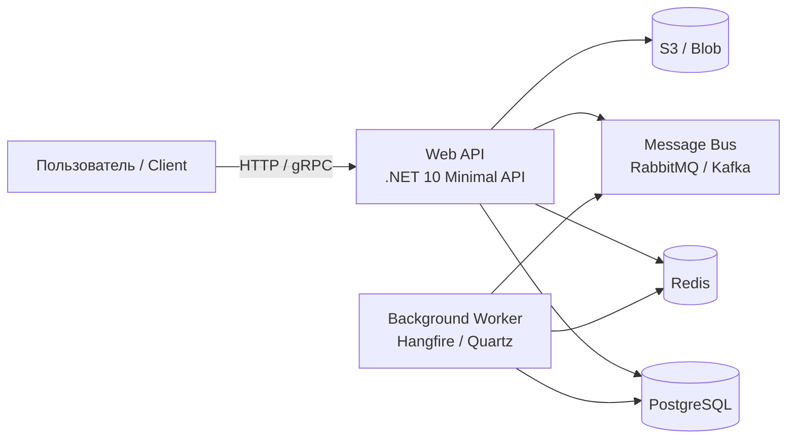

# Архитектурный инвентарь — шаблон для техлида

> **Назначение:** Зафиксировать текущую архитектуру проекта **перед** внедрением guardrails.  
> **Потребитель:** Человек (Tech Lead). Не агент.  
> **Результат:** На входе — кодбаза. На выходе — схема, границы сборок, критичные пути и зафиксированные решения, на которые опираются архитектурные тесты.

---

## Зачем это нужно

Архитектурные тесты (`NetArchTest`, `ArchitectureRules.cs`) проверяют **правила**.  
Но если правила не зафиксированы, агент не может их создать — он угадывает.  
Этот шаблон помогает за 30–60 минут нарисовать «карту местности», по которой потом строятся guardrails.

---

## 1. Container Diagram (C4 Lite)

Нарисуй текущую систему в 4–6 блоках. Не уходи в классы — только процессы и хранилища.



**Правило:** Если блока нет в диаграмме — нет и архитектурного теста на его границах.

---

## 2. Assembly Boundaries — границы сборок

Заполни таблицу: какие проекты/сборки есть и какие зависимости **разрешены**.

| Сборка | Назначение | Может ссылаться на | НЕ может ссылаться на | Тест (NetArchTest) |
|--------|-----------|--------------------|----------------------|-------------------|
| `MyApp.Domain` | Entities, Value Objects, Domain Services | `MyApp.Domain` (сама) | `MyApp.Application`, `MyApp.Infrastructure`, `MyApp.Api` | `Domain_ShouldNotDependOn_*` |
| `MyApp.Application` | Use Cases, DTOs, Interfaces (ports) | `MyApp.Domain` | `MyApp.Infrastructure`, `MyApp.Api` | `Application_ShouldNotDependOn_Infrastructure` |
| `MyApp.Infrastructure` | EF, HttpClients, Cache, FileStorage | `MyApp.Domain`, `MyApp.Application` | `MyApp.Api` | `Infrastructure_ShouldNotDependOn_Api` |
| `MyApp.Api` | Endpoints, Middleware, DI registration | `MyApp.Domain`, `MyApp.Application`, `MyApp.Infrastructure` | — (корневая) | `Api_ShouldDependOnlyOn_*` |

**Для Vertical Slice / Modular:**

| Фича / Модуль | Публичный API (что экспортирует) | Может вызывать | НЕ может вызывать |
|---------------|----------------------------------|----------------|-------------------|
| `Features.Booking` | `CreateBooking`, `GetBooking` | `Features.Payment` (через интеграционные события) | `Features.Payment.Internal.*` |
| `Features.Payment` | `ProcessPayment`, `Refund` | `Features.Notification` (через события) | `Features.Booking.Repository` |

> **Где хранить:** Эта таблица копируется в комментарий к `ArchitectureRules.cs` — она становится «контрактом», который ломает тест при нарушении.

---

## 3. Critical Paths — критичные пути

Какие цепочки нельзя сломать? Для каждой цепочки укажи: входную точку, ключевое хранилище, side effects.

| ID | Название | Вход | Обработка | Хранилище | Side Effects | Тест-шаблон |
|----|----------|------|-----------|-----------|--------------|-------------|
| CP-01 | Создание заказа | `POST /orders` | `OrderService.Create()` | `orders`, `order_items` | Отправка события `OrderCreated` в Bus | `BUG###_` regression + интеграционный |
| CP-02 | Обработка платежа | `PaymentReceived` (Bus) | `PaymentJob.Execute()` | `payments` | Обновление статуса заказа | Job test + Saga test |
| CP-03 | Экспорт отчёта | `GET /reports/daily` | `ReportService.Generate()` | `orders` (read-only) | Запись в Blob | Snapshot test на формат файла |

**Зачем:** Приоритизация тестов. Если ресурсов мало — сначала покрываем CP-01, потом CP-02.

---

## 4. Technology Inventory — технический инвентарь

Заполни один раз — используй при адаптации всех скиллов (`ADAPTATION.md`).

| Категория | Технология | Версия | Что это значит для guardrails |
|-----------|-----------|--------|-------------------------------|
| .NET | .NET 10 | 10.0.x | Nullable enabled, `required`, `init` — используем |
| Framework | Minimal API | — | Нет `[Authorize]` → проверяем `.RequireAuthorization()` |
| ORM | EF Core + PostgreSQL | 9.x | Есть `AsNoTracking`, `Include`, миграции |
| Cache | Redis (IDistributedCache) | — | Нет `SetSized()` — проверяем через regex |
| Tests | xUnit | 2.x | Адаптируем `verify-tests.sh`, не мигрируем на TUnit |
| CI | GitHub Actions | — | Шаблон `safe-ci.yml` подходит 1-к-1 |
| Arch | Clean Architecture | 4 проекта | NetArchTest применим напрямую |

> **Вычеркнуть при адаптации:** Если у вас Dapper — вычеркни все EF-правила. Если Worker Service — вычеркни HTTP-аудиты. Если .NET Framework 4.8 — вычеркни NetArchTest, используй Roslyn analyzers.

---

## 5. Numbered Decisions — зафиксированные архитектурные решения

Каждое осознанное отклонение от «стандарта» — с номером и обоснованием. Агенты видят номер и не «чинят» код.

### Шаблон

```markdown
### {PREFIX}-###: {Краткое название}
**Дата:** YYYY-MM-DD  
**Автор:** @username  
**Контекст:** {почему пришли к этому решению}  
**Решение:** {что именно сделали}  
**Последствия:** {что сломается, если откатить}  
**Где в коде:** {файл:строка}
```

### Примеры

```markdown
### PERF-022: Удалён QueryFilter на SoftDelete
**Дата:** 2026-03-15  
**Автор:** @lead  
**Контекст:** QueryFilter добавлял JOIN к users через Workspace.Owner.DeletedAt в каждом EXISTS-подзапросе. Под нагрузкой — деградация на 400ms.  
**Решение:** Убрали `HasQueryFilter(s => !s.IsDeleted)`. Soft delete реализован явно в запросах.  
**Последствия:** Агент, видя `HasQueryFilter` в других конфигах, попытается «исправить» это. Номер останавливает.  
**Где в коде:** `src/Infrastructure/Persistence/Configuration/SlotConfiguration.cs:31`
```

**Правила именования:**

| Префикс | Что фиксируем | Проверяет тест |
|---------|--------------|----------------|
| `PERF-###` | Оптимизация, отклонение от стандартного EF | `ArchitectureRules.cs` (уникальность ID) |
| `DB-###` | Решение по схеме БД (тип данных, индекс) | `ArchitectureRules.cs` (уникальность ID) |
| `AUD-###` | Решение по аудиту или логированию | `ArchitectureRules.cs` (уникальность ID) |
| `ARCH-###` | Решение по слоям или границам модулей | Добавь в тест самостоятельно |
| `SEC-###` | Исключение из security-правил (публичный webhook) | Добавь в тест самостоятельно |

> **Тест на уникальность:** Шаблон `ArchitectureRules.cs` проверяет, что `PERF-###`, `DB-###`, `AUD-###` уникальны по кодбазе. Дубликат = падение сборки. Префиксы `ARCH-###` и `SEC-###` — расширения; добавь их в regex теста (`(PERF|DB|AUD|ARCH|SEC)-\d{3}`) при необходимости.

---

## 6. Anti-Hallucination Checklist для техлида

Прежде чем передать инвентарь агенту для генерации guardrails, проверь:

- [ ] Диаграмма не содержит блоков, которых нет в `.sln` (иначе агент сгенерирует тесты на несуществующие сборки)
- [ ] Таблица сборок соответствует реальным `.csproj` (проверь через `dotnet sln list`)
- [ ] Каждый `PERF-###` / `DB-###` имеет точную ссылку на код (файл:строка)
- [ ] Critical Paths реально существуют (проверь через поиск по `Route` / `Queue` / `Job`)
- [ ] Technology Inventory соответствует `global.json` и `Directory.Packages.props`

---

## 7. Next Steps — что делать с инвентарём

1. **Сохрани** этот файл в `docs/ARCHITECTURE-INVENTORY.md` целевого проекта (рядом с `AGENTS.md`)
2. **Настрой `ArchitectureRules.cs`** — скопируй таблицу сборок в комментарий к тесту
3. **Проверь `ADAPTATION.md`** — вычеркни неприменимые проверки на основе Technology Inventory
4. **Запусти bootstrap** — агент использует этот файл как ground truth для генерации guardrails
5. **Обновляй** при добавлении сборок или изменении критичных путей

---

> **Принцип:** Guardrails работают только тогда, когда «правильно» зафиксировано. Этот шаблон — не документация для красоты, а input для архитектурных тестов.
