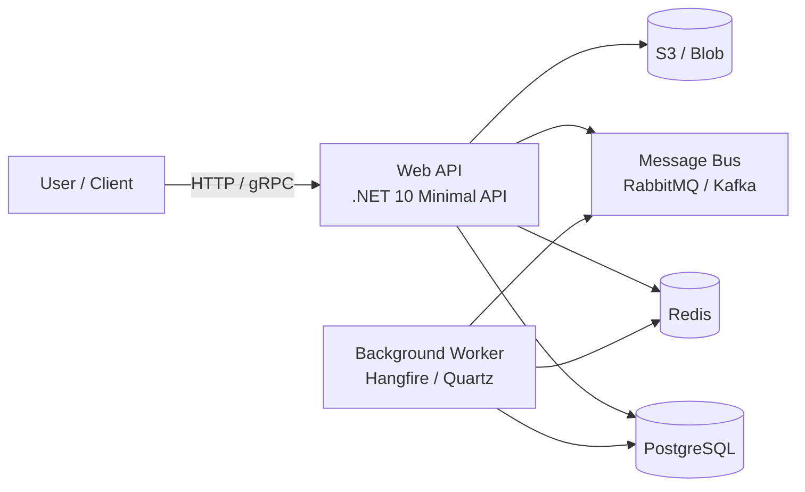

# Architecture Inventory — Template for Tech Lead

> **Purpose:** Document the current project architecture **before** implementing guardrails.  
> **Consumer:** Human (Tech Lead). Not an agent.  
> **Result:** Input — codebase. Output — schema, assembly boundaries, critical paths, and documented decisions that architecture tests rely on.

---

## Why This Is Needed

Architecture tests (`NetArchTest`, `ArchitectureRules.cs`) check **rules**.  
But if rules are not documented, the agent cannot create them — it guesses.  
This template helps draw a "terrain map" in 30–60 minutes, which guardrails are then built upon.

---

## 1. Container Diagram (C4 Lite)

Draw your current system in 4–6 blocks. Don't go into classes — only processes and storage.

**Rule:** If a block is not on the diagram — there is no architecture test for its boundaries.

---

## 2. Assembly Boundaries — Assembly Boundaries

Fill in the table: what projects/assemblies exist and what dependencies are **allowed**.

| Assembly | Purpose | Can reference | Cannot reference | Test (NetArchTest) |
|----------|---------|---------------|------------------|-------------------|
| `MyApp.Domain` | Entities, Value Objects, Domain Services | `MyApp.Domain` (itself) | `MyApp.Application`, `MyApp.Infrastructure`, `MyApp.Api` | `Domain_ShouldNotDependOn_*` |
| `MyApp.Application` | Use Cases, DTOs, Interfaces (ports) | `MyApp.Domain` | `MyApp.Infrastructure`, `MyApp.Api` | `Application_ShouldNotDependOn_Infrastructure` |
| `MyApp.Infrastructure` | EF, HttpClients, Cache, FileStorage | `MyApp.Domain`, `MyApp.Application` | `MyApp.Api` | `Infrastructure_ShouldNotDependOn_Api` |
| `MyApp.Api` | Endpoints, Middleware, DI registration | `MyApp.Domain`, `MyApp.Application`, `MyApp.Infrastructure` | — (root) | `Api_ShouldDependOnlyOn_*` |

**For Vertical Slice / Modular:**

| Feature / Module | Public API (what it exports) | Can call | Cannot call |
|------------------|------------------------------|----------|-------------|
| `Features.Order` | `CreateOrder`, `GetOrder` | `Features.Payment` (via integration events) | `Features.Payment.Internal.*` |
| `Features.Payment` | `ProcessPayment`, `Refund` | `Features.Notification` (via events) | `Features.Order.Repository` |

> **Where to store:** This table is copied into a comment in `ArchitectureRules.cs` — it becomes the "contract" that breaks the test when violated.

---

## 3. Critical Paths — Critical Paths

What chains must not be broken? For each chain specify: entry point, key storage, side effects.

| ID | Name | Entry | Processing | Storage | Side Effects | Test Template |
|----|------|-------|------------|---------|--------------|---------------|
| CP-01 | Order creation | `POST /orders` | `OrderService.Create()` | `orders`, `order_items` | Sending `OrderCreated` event to Bus | `BUG###_` regression + integration |
| CP-02 | Payment processing | `PaymentReceived` (Bus) | `PaymentJob.Execute()` | `payments` | Updating order status | Job test + Saga test |
| CP-03 | Report export | `GET /reports/daily` | `ReportService.Generate()` | `orders` (read-only) | Writing to Blob | Snapshot test on file format |

**Why:** Test prioritization. If resources are scarce — cover CP-01 first, then CP-02.

---

## 4. Technology Inventory — Technology Inventory

Fill in once — use when adapting all skills (`ADAPTATION.md`).

| Category | Technology | Version | What this means for guardrails |
|----------|------------|---------|--------------------------------|
| .NET | .NET 10 | 10.0.x | Nullable enabled, `required`, `init` — use them |
| Framework | Minimal API | — | No `[Authorize]` → check `.RequireAuthorization()` |
| ORM | EF Core + PostgreSQL | 9.x | There is `AsNoTracking`, `Include`, migrations |
| Cache | Redis (IDistributedCache) | — | No `SetSized()` — check via regex |
| Tests | xUnit | 2.x | Adapt `verify-tests.sh`, don't migrate to TUnit |
| CI | GitHub Actions | — | `safe-ci.yml` template fits 1-to-1 |
| Arch | Clean Architecture | 4 projects | NetArchTest applicable directly |

> **Cross out when adapting:** If you have Dapper — cross out all EF rules. If Worker Service — cross out HTTP audits. If .NET Framework 4.8 — cross out NetArchTest, use Roslyn analyzers.

---

## 5. Decision Guards (ADR) — Documented Architectural Decisions

Every conscious deviation from the "standard" — with a number and rationale. Agents see the number and don't "fix" the code.

> **Detailed template and examples:** see separate file [`DECISION-GUARDS.md`](DECISION-GUARDS.md).

**Summary:**

| Prefix | What we document | Checked by test |
|--------|------------------|-----------------|
| `PERF-###` | Optimization, deviation from standard EF | `ArchitectureRules.cs` (ID uniqueness) |
| `DB-###` | DB schema decision (data type, index) | `ArchitectureRules.cs` (ID uniqueness) |
| `AUD-###` | Audit or logging decision | `ArchitectureRules.cs` (ID uniqueness) |
| `ARCH-###` | Layer or module boundary decision | Add to test yourself |
| `SEC-###` | Security rule exception (public webhook) | Add to test yourself |

> **Uniqueness test:** `ArchitectureRules.cs` template checks that `PERF-###`, `DB-###`, `AUD-###` are unique across the codebase. Duplicate = build failure. Prefixes `ARCH-###` and `SEC-###` — extensions; add them to the regex test (`(PERF|DB|AUD|ARCH|SEC)-\d{3}`) as needed.

---

## 6. Anti-Hallucination Checklist for Tech Lead

Before handing the inventory to the agent for guardrail generation, check:

- [ ] Diagram does not contain blocks that don't exist in `.sln` (otherwise the agent will generate tests for non-existent assemblies)
- [ ] Assembly table matches real `.csproj` (check via `dotnet sln list`)
- [ ] Each `PERF-###` / `DB-###` has an exact code reference (file:line)
- [ ] Critical Paths actually exist (check via search by `Route` / `Queue` / `Job`)
- [ ] Technology Inventory matches `global.json` and `Directory.Packages.props`

---

## 7. Next Steps — What to Do with the Inventory

1. **Save** this file to `docs/ARCHITECTURE-INVENTORY.md` of the target project (next to `AGENTS.md`)
2. **If there are conscious deviations** — save [`DECISION-GUARDS.md`](DECISION-GUARDS.md) to `docs/DECISION-GUARDS.md` and fill in the template.
3. **Configure `ArchitectureRules.cs`** — copy the assembly table into a comment in the test
4. **Check `ADAPTATION.md`** — cross out non-applicable checks based on Technology Inventory
5. **Run bootstrap** — the agent uses this file as ground truth for guardrail generation
6. **Update** when adding assemblies or changing critical paths

---

> **Principle:** Guardrails work only when the "correct" is documented. This template is not documentation for beauty, but input for architecture tests.
